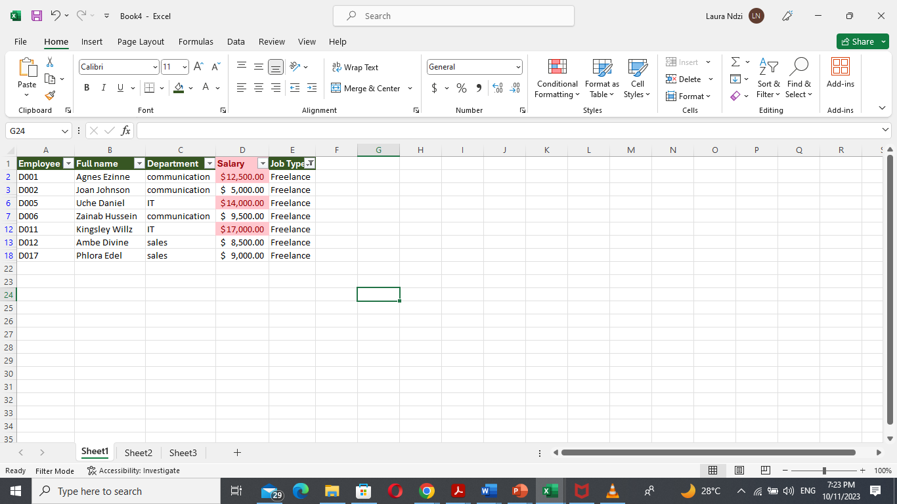
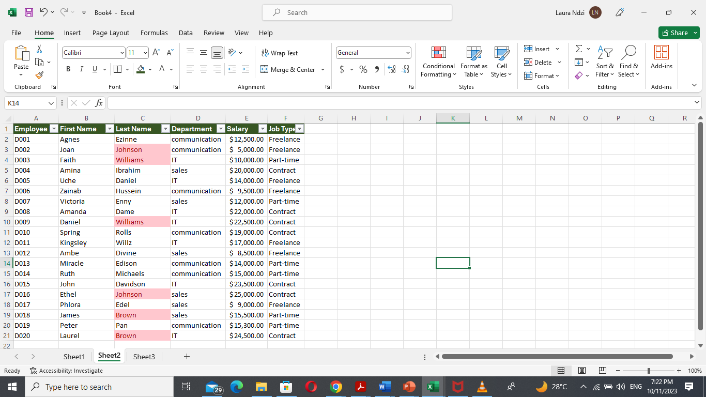
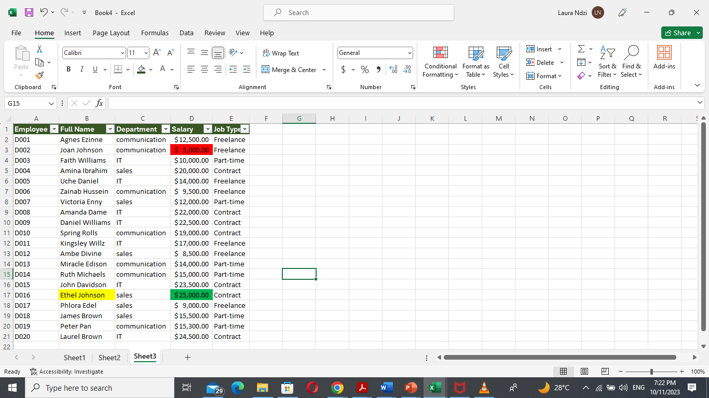
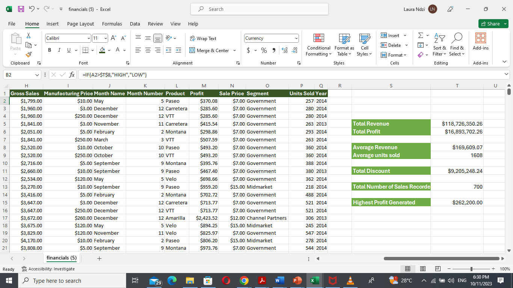
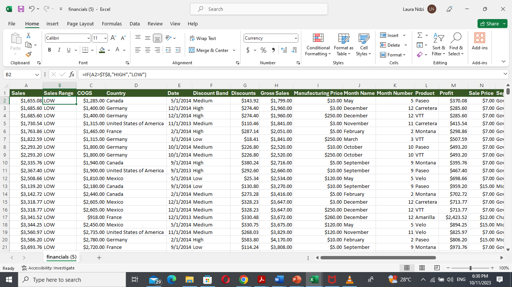

 
# Sales analysis task 1 - number of freelancers, highlight freelancers who earn > $10,000.00
In this data analysis project, I am dealing with employee data including their names, ID, Deaprtment, Salary and Job type.
In task 1, I want to know how many of the 20 Employees are Freelancers and how many of these free Lancers earn above $10,000.00
I began by using the filter on the Job type column to filter out other job types except Freelancers (7/20), and then to highlight those who earn more than $10,000.00
I selected the salary column, then clicked on conditional formatting, highlight cell rules, greater than and typed $10,000.00 and OK. The cells with salary > $10,000.00 were automatically highlighted

# Sales Analysis task 2 - Split employee name into First and second name 
For this task, I 
created a new column to the right of employee name 
then selected the employee name column 
then clicked on data on the tool bar 
clicked on 'text to columns' under data tools 
selected 'delimited' and next 
selected 'space' as delimiter and clicked next 
then clicked on text as data format 
and then clicked on finish 

To highlight duplicates I selected the First and Last Name columns
then clicked on conditional formatting in the honme tab 
then chose 'highlight cell rules'
then clicked on 'duplicate values' 
and the duplicates were then highlighted in red 

# Sales Analysis task 3 - Highlight Employees whose names begin with E in yellow, Highlight the highest salary in green and lowest salary in red 
For this task 
I selected the Employee name column 
then clicked on conditional formatting in the home tab under styles 
then clicked on new rule 
I selected 'format cells that contain' among the list of rules 
selected 'specific text' in the first drop down menu 
selected 'beginning with' in the second drop down menu 
then typed the letter 'E' in the last box 
To get the yellow format 
clicked on format, chose the yellow color and then clicked ok
1 employee name 'Ethel' was highlighted yellow 

For the employee Salary
select the salary column 
click on conditional formatting in the home tab under styles 
select 'Top/Bottom Rules'
select 'Top 10 items' and toggle down to 1, then choose the green color and click ok 
next follow the same process and select 'Bottom 10 items', toggle down to 1, then choose the red color and click ok

This data set comprised of sales data for a company shared with us by our instructor 
### Determine Total Revenue 
I used the sum function by selecting an empty cell, type equals to sign, type SUM and select it from the options 
I then selected the first row on the sales column, then clicked on CTRL+SHIFT+ARROW DOWN to get all the entries for the sales column 
then clicked OK

### Determine Total Profit 
I used the SUM function again as above, this time for the profit column 

### Determine Average Revenue 
I used the same process as above to get the average fucntion on an empty cell, then selected all the entries under the sales column and clicked ok 

### Determine Average Units sold 
Used the average function, as above and selected all the entries under the Units sold column, then clicked ok 

### Determine Total Discount 
Selected a free cell, used the SUM function and selected all the entries under the Discount column 

### Determine Number of Sales Recorded 
Selected a free cell, then typed the equal sign
type COUNT ans select the COUNT function 
select all the entries under the sales column to get the number of sales recorded 
then click ok 

### Determine highest profit generated 
select a free cell 
type in the equal to sign 
type max and select the MAX function
then select all the entries under the profit column and click ok 

### Determine if individual sales were higher or lower than the average sales 
I created a new column (called sales range) on the excel sheet just adjacent to the sales column 
in the first row of the new column I typed the equal sign 
then typed IF, selected the IF function 
type in the logical test , if cell value is greater than the average value of that row, the returned value should be "HIGH", otherwise "LOW"
then included the dollar signs next to the average sales reference (Fn+F4) inorder to make it an absolute reference.
i ended by flashfilling the rest of the rows on the sales range column 

